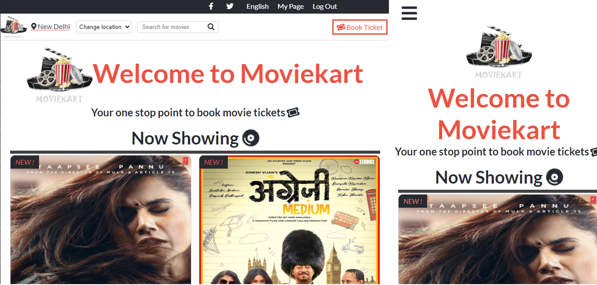

# Movie Tickets Booking Website [Solo Project]
This project consists of building a responsive website for movie tickets booking. It has three responsive pages- a Homepage, booking page and an About page. All the pages have three responsive breakpoints for small, medium and large screens.
I have used CSS flexbox to make the pages responsive

>Large screens

>Medium and small screens

The purpose of this project is to create a responsive website to book movie tickets.

## Built With

- HTML
- CSS
- Stylelint

## Live Demo

[Live Demo Link](https://raw.githack.com/alishabab/HTML-CSS-Capstone/master/index.html)

## Getting Started

To get a local copy up and running follow these simple example steps:

#### Prerequisites

- You should have installed git on your local machine, and a text editor, preferably VS Code.

#### Setup

- Clone the repository into your local machine.
- Open index.html

## Potential Future Features
- It does not have a backend currently, so a backend server can be developed to make the website a fully functional application.

## Authors

👤 **Author**

- Github: [@alishabab](https://github.com/alishabab)
- Twitter: [@shabab_ali](https://twitter.com/shabab_ali)
- Linkedin: [Shabab Ali](https://www.linkedin.com/in/shababali/)

## 🤝 Contributing

Contributions, issues and feature requests are welcome!

Feel free to check the [issues page](issues/).

## Show your support

Give a ⭐️ if you like this project!

## Acknowledgments

- Appreciation to my mentor and stand-up team.

## 📝 License

This project is [MIT](lic.url) licensed.
